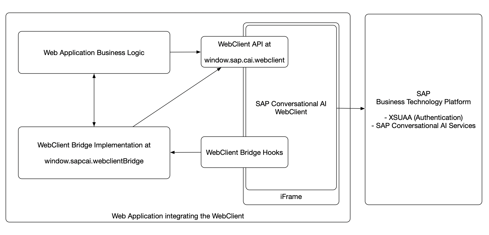

# Developer Guide for the SAP Conversational AI Web Client 

The SAP Conversational AI Web Client (henceforth Web Client) offers two main ways for developers to interact with it at runtime. It allows you to:

- call the Web Client API from your business logic
- implement the Web Client Bridge API in your web application

The following diagram shows a high level process of how the Web Client is integrated into a web application and illustrates the two interfaces (Web Client API and Web Client Bridge) and their place in the integration.



## Web Client API

The Web Client API exposes a public JavaScript API, which is available at runtime in your web application as soon as the Web Client is loaded. You can use it to interact with the Web Client programatically from within your web application business logic.

The API is available at the JavaScript object path: `window.sap.cai.webclient` and has the following methods:

- [open()](#open)
- [close()](#close)
- [toggle()](#toggle)
- [setTheme(themeName)](#setthemethemename)
- [sendMessage(message)](#sendmessagemessage)
- [onSTTResult(result)](#onsttresultresult)

### open()

Opens the Web Client.

### close()

Closes The Web Client.

### toggle()

Toggles show/hide of the Web Client. This can be attached to an own button in the application in order to toggle display of the Web Client.

### setTheme(themeName)

Sets the theme of the Web Client.


| Parameter | Description |
| ---- | ----------- |
| themeName | *string*<br>The name of the theme to be set |

### sendMessage(message)

Sends the given message to the underlying bot.

| Parameter | Description |
| ---- | ----------- |
| message | *string*<br>The message string to be sent |

### onSTTResult(result)

Sends a final or interim Speech-To-Text transcription result to the Web Client and updates the UI. If the 'final' flag is set to `true`, the UI will exit the listening mode and will automatically send the text as a message to the bot. If the flag is set to `false`, the UI will only update the text but will remain in listening mode.

| Parameter | Description |
| ---- | ----------- |
| result | *object*<br>An object of the form <br> { <br>text: 'A string',<br> final: true or false <br>} |

## Web Client Bridge API

The Web Client Bridge API offers a way to extend or customize the functionality of the Web Client by implementing a defined interface whose methods are called by the Web Client at runtime.

The object has to be registered at object path `window.sapcai.webclientBridge`.

For more information about the recommended implementation pattern, see section [Implementing the Web Client Bridge](#implementing-the-web-client-bridge).

The supported interface methods are:

- [getApplicationId()](#getapplicationid)
- [getChannelPreferences()](#getchannelpreferences)
- [getMemory()](#getmemory)
- [onMessage(payload)](#onmessagepayload)
- [getClientInfo(defaults)](#getclientinfodefaults)

---
**NOTE**

Please note that the return type of each method can either be the documented type or a promise resolving to that type, in case asynchronous processing is required. All Speech-To-Text related methods have to be declared with the `async` keyword because they are inherently assumed to be asynchronous.

---

### getApplicationId()

Returns the unique application ID of your web application. 
This can be any computed string that identifies this instance of your application uniquely.

An example for a Fiori Launchpad could be 'CCF715' which is the name of the underlying ABAP system plus client.
 
The application ID can be referenced in the channel configuration of the Bot Connector in order to assign one or multiple channels to an application ID.
If you don't use the application ID in your channels, you don't need to implement this method.

| Returns||
| - | - |
| *string* | The application ID |


### getChannelPreferences()

When the SAP Conversational AI Web Client starts using a specific channel,
it first fetches the preferences as defined in the channel.
If implemented, the properties returned by this function will 
overwrite the channel properties.

The following preferences are supported
|Name|Type|Description|
|-|-|-|
|accentColor|CSS Color|The accent color of the web client|
|botMessageBackgroundColor|CSS Color|The background of a bot reply|
|botMessageColor|CSS Color|The font color of a bot reply|
|complementaryColor|CSS Color|The secondary accent color|
backgroundColor|CSS Color|The background color of the web client|
headerTitle|String|The title of the web client|
userInputPlaceholder|String|The input placeholder|
botPicture|URL|The picture displayed next to the bot replies|
userPicture|URL|The picture displayed next to the user message|
welcomeMessage|String|A welcome message displayed on first load

| Returns||
| - | - |
| *object* | The channel preferences as a JavaScript object containing the supported keys listed above. |

### getMemory()

This function is called before a message is sent to the bot and allows to provide context information to the bot request. This object is then available as 'memory' in the SAP Conversational AI bot builder (for example, in handlebars [scripting syntax](https://help.sap.com/viewer/a4522a393d2b4643812b7caadfe90c18/latest/en-US/b4f08a9a66434327a405b6934880445c.html)).
 
| Returns||
| - | - |
| *object* | The memory object of the form<br> {<br> memory: { myKey: 'myValue', ... },<br> merge: true or false<br>} |

The 'merge' flag in the return object behaves as follows: If set to `true`, the payload is merged with the existing memory, overriding common keys, but keeping the ones absent from the payload. If set to `false` or `missing`, the memory is replaced entirely by your payload.

### onMessage(payload)

This function is called each time the Web Client receives response messages from the bot and hence allows your web application to react to incoming bot responses. You could, for example, parse message payloads and dynamically change the state of your web application.
| Parameter | Description |
| ---- | ----------- |
| payload| *object*<br>A payload object of the form<br>{ messages: [array of messages] } |

### getClientInfo(defaults)

This function will be called once when the Web Client is loaded and allows to provide a set of supported static user- or client-level attributes (e.g. language and timezone). These values will then be made available in the Bot Builder as object 'client_info' and can be accessed just like 'memory'.

| Parameter | Description |
| ---- | ----------- |
| defaults| *object*<br>An object with the currently automatically detected property values for the supported properties. The language and timezone are detected from the browser.|

| Returns||
| - | - |
| *object* | The client_info object of the form<br> {<br> language: 'en',<br> forceLanguage: false,<br>timezone: 'America/Los_Angeles'<br>} |

The following properties are supported
|Name|Type|Description|
|-|-|-|
|language|string|The preferred language of the current user, in [ISO 639-1](https://www.iso.org/standard/22109.html) language code format|
|forceLanguage|boolean|Flag indicating if the bot language will be hardly set to the provided language, skipping any automatic language detection|
|timezone|string|The timezone of the current user, in IANA time zone format, for example 'America/New_York'. (https://en.wikipedia.org/wiki/Tz_database)|

## Speech-To-Text Integration

The following Web Client Bridge API functions are related to integrating Speech-To-Text (STT) into the Web Client. These functions can be implemented to integrate any STT service into the Web Client. 

The microphone button and its related UX controls will be enabled if the Web Client detects the STT that is implemented in the bridge.

API:

- [async sttGetConfig()](#async-sttgetconfig)
- [async sttStartListening([metadata])](#async-sttstartlisteningmetadata)
- [async sttStopListening()](#async-sttstoplistening)
- [async sttAbort()](#async-sttabort)
- [async sttOnFinalAudioData([blob, metadata])](#async-sttonfinalaudiodatablob-metadata)
- [async sttOnInterimAudioData([blob, metadata])](#async-sttoninterimaudiodatablob-metadata)

### async sttGetConfig()

Returns an object with STT configuration settings.

**This function has to be implemented and return an object in order for the Web Client to even enable the microphone button and assume that STT is implemented.**

| Returns||
| - | - |
| *object* | The STT config object |

The return object looks like this:
```
{
  // set to true if you want the Web Client to record audio 
  // out of the box using the browsers MediaRecorder. If
  // set to false, you need to implement the audio recording yourself
  useMediaRecorder: true|false, 

  // the following fields are only relevant if 'useMediaRecorder' = true.

  // how often should the MediaRecorder send interim audio data to the hook functions
  interimResultTime: <number of milliseconds>, 
  
  audioMetaData: { // audio format that the audio will be recorded in 
        // any codec supported by the browser MediaRecorder spec
        type: 'audio/ogg;codecs=opus',
        fileFormat: <file format>,
        encoding: <encoding> (e.g. 'opus'),
      }
  }

```

### async sttStartListening([metadata])

This function is called at the beginning of a new microphone interaction and should be used to do any kind of STT service initialization.

| Parameter | Description |
| ---- | ----------- |
| params| *array*<br>An array containing the function parameter 'metadata'.|
| metadata (in params array) | An object containing 'language' and 'audioMetadata'. This can be used to initialize the STT service for different languages or audio formats.

Example implementation:

```
sttStartListening: async (params) => {
 const [metadata] = params
 const { language, audioMetadata } = metadata
 
 // initialize your STT service session, e.g. creating a WebSocket client and registering callbacks

}
```

### async sttStopListening()

This function is called to notify the bridge that listening should be stopped, however everything that was already transcribed or is still in the process of being transcribed should still be completed and delivered to the UI.

For example, if `useMediaRecorder: true` was returned in `sttGetConfig`, the Web Client will call this function when the client side audio has reached a silence threshold, automatically ending the listening mode. However, the final audio shall still be sent to the STT service and the final transcription result will be delivered shortly after this function was called. Hence, depending on the STT service, this function should not abruptly close all service connections, but rather wait until a final result or close has been reached.

Example implementation (assuming a WebSocket client is used as an interface to an STT cloud service):

```
sttStopListening: async () => {
    // close a WebSocket client after 5 seconds, assuming that this is enough time for the cloud to deliver a final result
    setTimeout(() => {
      if (wsclient) {
        wsclient.close()
      }
    }, 5000)
  },
```

### async sttAbort()

This function is called by the Web Client if the ongoing listening session should be closed immediately and any results should also be immediately dismissed.

Example implementation

```
sttAbort: async () => {
    if (wsclient) {
      // close client immediately, don't wait for in process transcription results
      wsclient.close()
    }
  },
```

### async sttOnFinalAudioData([blob, metadata])

This function is called if `useMediaRecorder: true` was returned by `sttGetConfig` and will contain the final audio blob. Final means that the Web Client has stopped the MediaRecorder after this blob, most likely due to an automatic silence detection.

| Parameter | Description |
| ---- | ----------- |
| params| *array*<br>An array containing the function parameters.|
| blob (in params array) | A JavaScript blob object containing the recorded binary audio data. |
| metadata (in params array) | The metadata object, containing 'language' and 'audioMetadata' |

Example implementation
```
sttOnFinalAudioData: async (params) => {
    if (wsclient) {
      const [blob, metadata] = params
      // Example: Send audio data to the STT cloud service
      wsclient.send(blob)
    }
}
```

### async sttOnInterimAudioData([blob, metadata])

This function is called if `useMediaRecorder: true` was returned by `sttGetConfig` and will contain the an interim audio blob. This function will be called every `interimResultTime` milliseconds, as returned by `sttGetConfig`.
This can be used to live transcribe the user's audio input, instead of waiting for the full audio to be recorded. This assumes that the STT service and the used STT model also support interim results (please check the documentation of your STT service provider).

| Parameter | Description |
| ---- | ----------- |
| params| *array*<br>An array containing the function parameters.|
| blob (in params array) | A JavaScript blob object containing the recorded binary audio data. |
| metadata (in params array) | The metadata object, containing 'language' and 'audioMetadata' |

Example implementation
```
sttOnInterimAudioData: async (params) => {
    if (wsclient) {
      const [blob, metadata] = params
      // Example: Send audio data to the STT cloud service
      wsclient.send(blob)
    }
}
```


## Implementing the Web Client Bridge

There are two technical limitations with the `window.sapcai.webclientBridge` object to consider when implementing the bridge:

1. The `window.sapcai.webclientBridge` object must be present in your web application _before_ the Web Client is loaded
2. Any changes to that object (for example changing its implementation dynamically) are _not_ considered by the Web Client after the fact anymore


### Straight Forward Case
This means that if you have a web app, where you can define the bridge implementation object before the Web Client is loaded and you don't have the requirement to change its implementation dynamically, you're good with the straight forward implementation approach.

Somewhere in your startup code, just define the object:

```
// your startup code

window.sapcai.webclientBridge = {

  getMemory: () => {
    ...
  },

  onMessage: (payload) => {
    ...
  },

  etc

}
```

### Enabling Dynamic Bridge Implementations

We recommend the following implementation pattern in case your web app either:

- cannot define the full bridge implementation before the Web Client is loaded
- or needs to switch the implementation dynamically based on the state of your web app


1. As part of your startup or initialization code, add the `window.sapcai.webclientBridge` object, but only implement all methods as skeleton methods, delegating the call to an `Impl` object:

```
window.sapcai.webclientBridge = {
    getMemory: () => {
       if (window.sapcai.webclientBridgeImpl) {
           return window.sapcai.webclientBridgeImpl.getMemory()
       }
    },

     onMessage: (payload) => {
       if (window.sapcai.webclientBridgeImpl) {
           return window.sapcai.webclientBridgeImpl.onMessage(payload)
       }
    },

    // etc, the same for all supported webclient bridge functions
}
```

By fixing the `webclientBridge` object to this static implementation, your web app can always define it before the Web Client is loaded (which is required), but you stay flexible in changing the implementation. 

2. Later, in the initialization code of your pages or components which actually provide a Web Client Bridge implementation, just set the `window.sapcai.webclientBridgeImpl` object. This way you can dynamically switch the implementation depending on which page or component the user navigates to.

```

// initialization code of a certain page or component of your web app

window.sapcai.webclientBridgeImpl = {

  getMemory: () => {
    return {
      memory: {
        currentPage: 'orders',
      },
      merge: false
    }
  },

  onMessage: (payload) => {
    const { messages } = payload
    // do something with messages on the 'orders' page
    ...
  }
}

```

